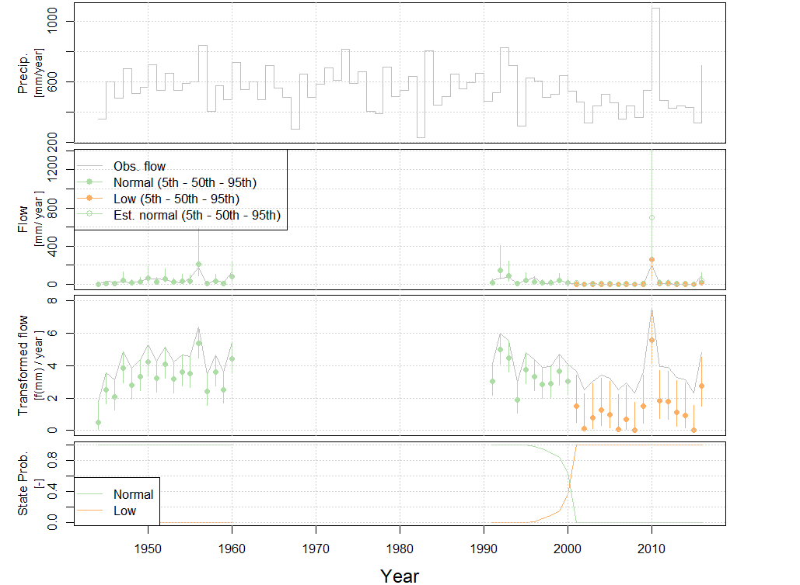

```{r, include = FALSE}
knitr::opts_chunk$set(
  collapse = TRUE,
  comment = "#>"
)
```

```{r setup}
library(hydroState)
```

## Adjusting the default state model
Nature is messy where the default state model from the `annual.two.state` vignette might not adequately fit the observed rainfall-runoff relationship. In order for the state shifts to be statistically adequate and informative, the model's residuals must adhere to the required checks in `plot.residuals` (uniform and normally distributed with no trends or auto-correlation). This vignette introduces a suite of options to adjust the default state model when model residuals do not meet the checks. Most often, this requires adjusting the shape of the residual distribution (`error.distribution`), applying auto-correlation terms (`parameters`), or possibly allowing for change in different model parameters (`state.shift.parameters`).

This vignette works through an example comparing the default model with an adjusted model. It concludes with the introduction of `buildModelAll` that systematically builds all possible adjustments in the state model in order to identify the best performing model when models are fitted. 

## Load required data
Annual rainfall-runoff models require a data frame with catchment average runoff and precipitation for each year. Load the data into the environment. Ensure there are three columns named "year", "flow", and "precipitation", and verify the units for flow and precipitation are the same ('mm', 'in', etc.).

```r
data(streamflow_annual_407211)

# check input data
head(streamflow_annual_407211)
#> year      flow precipitation
#> 1944  0.147021      351.6244
#> 1945 34.849993      598.9727
#> 1946 24.604912      488.5723
#> 1947 23.384022      685.1269
#> 1948 17.931727      524.1311
#> 1949 35.864082      564.7229
```

## Build a hydroState model with an adjusted the state model
While building the model, adjust the state model that better suites the distribution or auto-correlation within the residuals. `buildModel` provides several options to better define the rainfall-runoff relationship. When model residuals are not normally distributed, consider changing the `error.distribution` to `gamma` or `normal`. If auto-correlation is present, consider including an `AR1`, `AR2`, or `AR3` term within `parameters` to assume auto-correlation of 1, 2, or 3 time lags. It is also possible to reduce auto-correlation by allowing for 3-states rather than two by adjusting the `transition.graph` to equal `matrix(TRUE,3,3)`. Or the shift could be occurring within a different model parameter and this adjustment involves specifying the `state.shift.parameters`.

Below are four options to adjust the state model to better fit the model's residuals. For further details, see `buildModel` in the [hydroState user manual](https://github.com/peterson-tim-j/HydroState/hydroState.pdf).

1) `parameters` - include `AR1`, `AR2`, or `AR3` to assume auto-correlation of 1, 2, or 3 time lags 
2) `state.shift.parameters` - adjust the state dependent parameter to `a1` or one of the auto-correlation terms.  
3) `error.distribution` - adjust the assumed distribution of the model residuals. `truc.normal`, `normal`, and `gamma` are available.
4) `transition.graph` - adjust the model from a 2-state to 3-state. Available options: 1-state = `matrix(TRUE,1,1)`, 2-state = `matrix(TRUE,2,2)`, or 3-state = `matrix(TRUE,3,3)`

For this example, we compare the default state model and adjusted model. The default state model is first defined. Then an adjusted state model is created that assumes a gamma distribution in the residuals, 2-states, auto-regressive lag of 2 time-steps, and `a1` as a state dependent parameter rather than `a0'. Note, a message appears after building the adjusted model with an `AR2` term because the first two streamflow observations are removed to allow the model to warm-up. See details in `buildModel`.

```r
# Default state model
default.model.annual = buildModel(input.data = streamflow_annual_407211,
                              parameters = list('a0','a1','std'),
                              state.shift.parameters = list('a0','std'),
                              error.distribution = list('truc.normal'),
                              transition.graph = matrix(TRUE,2,2))

# Adjusted state model assuming the residuals are a gamma distribution, AR2, 2-state, a1
adjusted.model.annual = buildModel(input.data = streamflow_annual_407211,
                              parameters = list('a0','a1','std','AR2'),
                              state.shift.parameters = list('a1','std'),
                              error.distribution = list('gamma'),
                              transition.graph = matrix(TRUE,2,2))

"AR2 model built, but initial precipitation observations did not preceed initial flow observations by 2 timesteps at index: "1", "2". For best performance, precipitation should preceed flow in the input.data so AR2 model warms-up."
```

## Fit the models
Fit both models with `fitModel`.
```r
default.model.annual = fitModel(default.model.annual, pop.size.perParameter = 10, max.generations = 500)
#> ... Finished Calibration.
#>     Best solution: 40.0121967394132

adjusted.model.annual = fitModel(adjusted.model.annual, pop.size.perParameter = 10, max.generations = 1000)
#> ... Finished Calibration.
#>     Best solution: 26.5992963791061

```
## Compare models based on AIC
The adjusted model has a lower AIC suggesting it better fits the rainfall-runoff relationship at for this catchment. To validate the adjusted model is the most suitable, lets evaluate the residuals of each model.
```r
get.AIC(default.model.annual)
#> [1] 96.02439

get.AIC(adjusted.model.annual)
#> [1] 73.19859
```

## Review the residuals
Review the residuals of both models using `plot.residuals` to determine which model is more adequate (uniform and normally distributed with no trends or auto-correlation in the residuals). The following two figures show the adjusted state model that assumes a gamma distribution of the residuals, 'adjusted.model.annual', is more adequate with a Shapiro-Wilks p-value greater then 0.05 suggesting residuals are normally distributed. 

```r
# review residual plots
plot.residuals(default.model.annual, do.pdf = T, ID ='407211')

plot.residuals(adjusted.model.annual , do.pdf = F, ID ='407211')

```
<center>
{width=100%}
<\center>

## Evaluate the state-shifts
Set the state names relative to a year in the record using `setInitialYear` and evaluat the flow states overtime of the adjusted model using `plot.states`. The year 1991 is selected as the initial year because there is not sufficient streamflow data for 1990 at this site (Bet Bet Creek - 407211).

```r
# set the reference year to name the states
adjusted.model.annual = setInitialYear(adjusted.model.annual , 1991)

# plot all four plots
plot.states(adjusted.model.annual)

```
<center>
{width=70%}
<\center>

## Systematic state model selection
How do we know which state model is the best given our observations? Rather than manually testing every adjustment of the state model, the `buildModelAll` function builds every possible state model combination (each distribution, auto-correlation terms, and 1 to 3-states) while the intercept, `a0` and error `std` are considered `state.shift.parameters`. The function performs similarly to `buildModel` and can easily replace this function in the workflow. After being built, the models can be fitted using the `fitModel` function. This function fits each model iteratively, and requires each model to provide a better fit than the previous simpler model known as the reference model. Each model undergoes 20 calibration trials, and if the best model fit of the trails is not less than or equal to the reference model calibration, the calibration reference criteria in the list of models is '0'. To see a summary of the order of the reference models and revise them, use the `showModelAll` function. Once the models are fitted, the best model is the one with the lowest AIC, and the `get.AIC` function outputs a table with each model and AIC.

Below is a an example of how to set up `buildModelAll`, and perform the steps to adjust the reference table using `showModelAll`, fit the models using `fitModel`, and identify the model with the lowest AIC. Note, fitting all models can take several hours to run. 

```{r  eval = FALSE}
# Build all model combinations with 'a0' and 'std' as state-dependent parameters
all.models = buildModelAll(input.data = streamflow_annual_407211,
                           state.shift.parameters =list('a0','std'),
                           siteID = "407211")

# Review the order of the reference models, adjust reference models if needed.
all.models.ref.table = showModelAll(all.models)

# If reference models are adjusted, then re-build models
all.models = buildModelAll(input.data = streamflow_annual_407211,
                               state.shift.parameters = list('a0','std'),
                               reference.table = all.models.ref.table)

# Fit all models (uncomment to run)
<!-- all.models = fitModel(all.models, pop.size.perParameter = 10, max.generations = 5000, doParallel = T) -->

#> Calibrating  72 Models.
#> ... Minimum number of calibration per model:  5
#> ... Maximum number of calibration per model:  20
#> ************************************
#> Calibrating Model: model.1State.truc.normal.log.AR0.a0
#> Reference model name for maximum acceptable calib. solution: 
#> Reference model maximum acceptable calib. solution: -Inf
#> ...

# get table of AIC values for each model
get.AIC(all.models)

#>                                            AIC  nParameters  AIC.weights
#>model.2State.gamma.log.AR0.a0           79.36469           8 1.945165e-01
#>model.2State.gamma.boxcox.AR0.a0        79.36469           8 1.945165e-01
#>model.2State.gamma.boxcox.AR2.a0        79.39221          10 1.918586e-01
#>model.2State.gamma.log.AR2.a0           79.39221          10 1.918586e-01
#>model.2State.gamma.boxcox.AR3.a0        81.39029          11 7.064855e-02
#>model.2State.gamma.log.AR3.a0           81.39029          11 7.064855e-02
#>model.2State.gamma.boxcox.AR1.a0        82.48915           9 4.078382e-02
#>model.2State.gamma.log.AR1.a0           82.48915           9 4.078382e-02
#>model.1State.gamma.boxcox.AR2.a0        89.13483           5 1.470268e-03
#>model.1State.gamma.log.AR2.a0           89.13483           5 1.470268e-03
#>...
```

