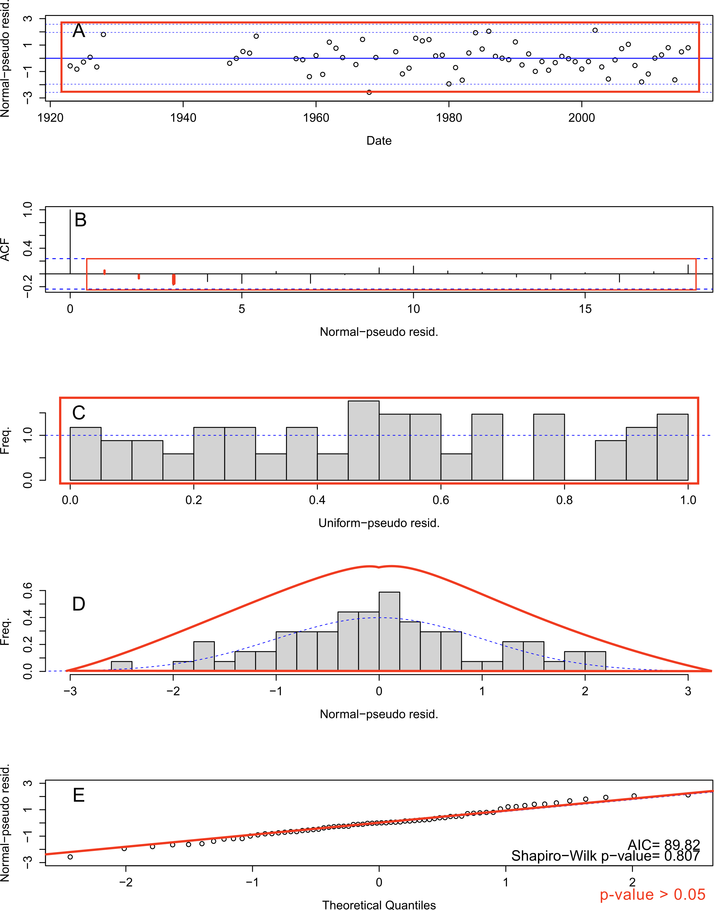
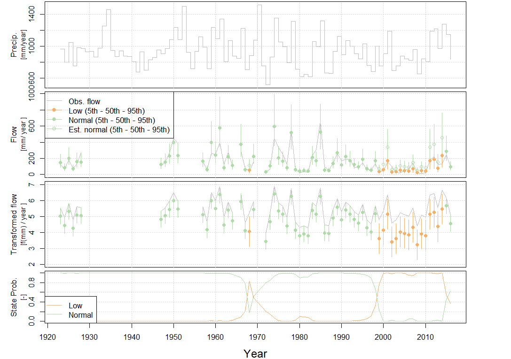

```{r, include = FALSE}
knitr::opts_chunk$set(
  collapse = TRUE,
  comment = "#>"
)
```

```{r setup}
library(hydroState)

# citr::tidy_bib_file(
#   rmd_file = c("annual.two.state.Rmd", "monthly.two.state.Rmd"),
#   messy_bibliography = "Dissertation.bib", #updated by Zotero
#   file = "references.bib" #read in by R
# )
```

# Introduction
hydroState provides methods to construct and evaluate hidden Markov models (HMM) of annual, seasonal, or monthly streamflow runoff with precipitation as a predictor. Streamflow and precipitation vary overtime, and their relationship can often be non-stationary where a change in streamflow cannot entirely be explained by a change in precipitation. hydroState offers the necessary tools to identify this non-stationary change in catchments overtime. This shift in the rainfall-runoff relationship to an alternate hydrological state can even persist after a pro-longed drought. For more detail on the underlying methods and motive, see: Peterson TJ, Saft M, Peel MC & John A (2021), Watersheds may not recover from drought, Science, DOI: 10.1126/science.abd5085. 

This shift to an alternate state is defined through evaluating a linear model that simulates runoff, $\widehat{Q}$, with precipitation, $P$, as a predictor:$$\widehat{Q} = Pa_1 + a_0$$ where $a_1$ and $a_0$ are constant parameters. hydroState fits this model overtime using a hidden Markov model approach that allows runoff to shift states at each time step. The probability of shifting states depends on the distribution of states at prior time steps. The shift can occur within either of the following parameters: $a_1$, $a_0$, and/or the error, $std$. The default model (worked through here) considers a state shift in the intercept, $a_0$ and error, $std$. This vignette provides an example of how to build and evaluate an annual model, and this is a great place to start. hydroState offers additional tools to refine the rainfall-runoff relationship and evaluate on seasonal and monthly time-steps. These are further introduced in the other vignettes.

## Load required data
Annual rainfall-runoff models require a data frame with catchment average runoff and precipitation for each year. Load the data into the environment. Ensure there are three columns named "year", "flow", and "precipitation", and verify the units for flow and precipitation are the same ('mm', 'in', etc.).

```r
data(streamflow_annual_221201)

# check input data
head(streamflow_annual_221201)
#>  year      flow precipitation
#>1 1923 125.09053      961.6729
#>2 1924  63.94195      795.7554
#>3 1925 184.41702     1045.1675
#>4 1926  71.62613      749.1795
#>5 1927 130.10813      981.1049
#>6 1928 269.01408      969.8059
```

## Build a 2-state annual hydroState model
Build the the 2-state annual hydroState model with `buildModel`. This model is the default and only requires input data. The input data can have gaps in flow or precipitation. A message will appear when gaps are in the data, but the model is still built. Handling the gaps are discussed in the `buildModel` documentation. In order to adjust the default model, resort to the next vignette: [adjust.state.model](https://github.com/peterson-tim-j/HydroState/tree/master/vignettes/adjust.state.model/adjust.state.model.html). This `buildModel` command also accepts seasonal or monthly data if the input data contains these time-step. See vignette:  [subAnnual.models](https://github.com/peterson-tim-j/HydroState/tree/master/vignettes/subAnnual.models/subAnnual.models.html). 

```r
default.model.annual = buildModel(input.data = streamflow_annual_221201)
```

## Fit the model
Fit the parameters of the built model with `fitModel` that calibrates the model through maximum likelihood estimation. The likelihood is estimated recursively across each time-step, for each continuous period of observations, and the sum of the negative log-likelihoods from each period is minimized too calibrate the model parameters. For more details on the likelihood function, refer to `fitModel` documentation. The calibration procedure optimizes the model parameters using the [DEoptim](https://github.com/ArdiaD/DEoptim) R-package. When `fitModel` is initiated, the output prints the initial negative log-likelihood value from the initial parameters, and the calibration settings. Every 25 iterations, the best set of parameter values, _bestmemit_, and lowest negative log-likelihood, _bestvalit_, are printed to the console. It will take a few seconds to completely calibrate the model. When calibration reaches the maximum number of generations, increase `max.generations`.

```r
default.model.annual = fitModel(default.model.annual, pop.size.perParameter = 10, max.generations = 500)

#>... Starting calibration using the following settings:
#>    - Initial parameter set neg. log liklihood: Inf
#>    - total population size: 90
#>    - relative tolerance: 1e-08
#>    - iterations required that meet the tolerance: 50
#>    - maximum iterations allowed: 500
#>    - DEoptim strategy type: 3 
#>Iteration: 25 bestvalit: 52.490485 bestmemit:   -4.297386    0.011387    0.008619   -2.391905    0.522673    0.335929    0.337020    0.857055    0.556159
#>Iteration: 50 bestvalit: 37.572710 bestmemit:   -4.818044    0.008852    0.015845   -2.450097    0.416463    0.121642    0.832793    0.941794    0.252304
#>Iteration: 75 bestvalit: 36.923899 bestmemit:   -4.478514    0.009273    0.016020   -2.449549    0.413689    0.121469    0.892506    0.959339    0.000972
#>Iteration: 100 bestvalit: 36.908512 bestmemit:   -6.983881    0.009347    0.016090   -2.450366    0.416905    0.120549    0.896700    0.961387    0.000126
#>Iteration: 125 bestvalit: 36.908188 bestmemit:   -7.459433    0.009366    0.016125   -2.450803    0.417723    0.120532    0.896099    0.961124    0.000000
#>Iteration: 150 bestvalit: 36.908180 bestmemit:   -7.962110    0.009364    0.016121   -2.450759    0.417812    0.120538    0.896094    0.961110    0.000000
#>Iteration: 175 bestvalit: 36.908176 bestmemit:   -8.011148    0.009365    0.016122   -2.450765    0.417787    0.120533    0.896105    0.961132    0.000000
#>Iteration: 200 bestvalit: 36.908176 bestmemit:   -8.010275    0.009365    0.016122   -2.450765    0.417787    0.120533    0.896102    0.961131    0.000000
#>... Finished Calibration.
#>    Best solution: 36.908175905606

```

## Review the residuals
Review the model's residuals from figures using `plot.residuals` to ensure they are uniform and normally distributed with no trends or auto-correlation. A large plot with five figures (A-E) is produced and the check for each is discussed below. There is also an option to export the plot as a PDF with `do.pdf = T` and label plots with the site ID (i.e. `ID = 221201`). Alternatively, the residuals can be reviewed without plotting using `get.residuals` which returns a data frame of the normal pseudo residuals at each time-step. If the residuals of the fitted model do not meet these checks below, consider adjusting the model as discussed in the next vignette ([adjust.state.model](https://github.com/peterson-tim-j/HydroState/tree/master/vignettes/adjust.state.model/adjust.state.model.html)).

A)  Time-series of normal-pseudo residuals to ensure the residuals each year are within the confidence intervals.
B)  Auto-correlation function (ACF) of normal-pseudo residuals to ensure there is no serial correlation in residuals. Lag spikes should be below confidence interval at each lag (except 0).
C)  Histogram of uniform-pseudo residuals should show uniform distribution (a "box" where there is equal frequency for each residual value)
D)  Histogram of normal-pseudo residuals should show normal distribution centered on zero and with no skew
E)  Quantile-Quantile (Q-Q) plot where normal-pseudo residuals vs. theoretical quantities should align on the diagonal line. This last plot contains the Akaike information criterion (AIC) and Shapiro-Wilk p-value. 
     +    The AIC is an estimator to determine the most parsimonious, best performing model given the number of parameters. When comparing models, the lowest AIC is the best performing model. 
     +    Shapiro-Wilks test for normality in the residuals. A p-value greater than 0.05 (chosen alpha level) indicates the residuals are normally distributed


```r
# review residual plots
plot.residuals(default.model.annual, do.pdf = F, ID ='221201')

# get residual values
model.residuals = get.residuals(default.model.annual)
```
<center>
{width=70%}
</center>


## Evaluate the state-shifts
Set the state names relative to a year in the record using `setInitialYear`. This provides a name for the states so they are easier to interpret in the following figures. Then plot the state-shifts overtime using `plot.states`. In this example, 1990 is chosen as the year of reference, but any year can be selected as the reference year. All four plots within the function are shown here, but either plot or combination of plots can be selected. Alternatively, the states can be reviewed without plotting using `get.states` which returns a data frame of states at each time-step.

```r
# set the reference year to name the states
default.model.annual = setInitialYear(default.model.annual, 1990)

# plot all four plots
plot.states(default.model.annual)

```
<center>
{width=70%}
</center>

To only receive the results without plotting a figure, use `get.states`. This exports the Viterbi flow states, Normal flow state, conditional probabilities, and emission density. Please refer to `get.states` in the [hydroState user manual](https://github.com/peterson-tim-j/HydroState/hydroState.pdf) for further explanation  .

```r

# get data frame of state values
model.states = get.states(default.model.annual)

head(model.states)
```

