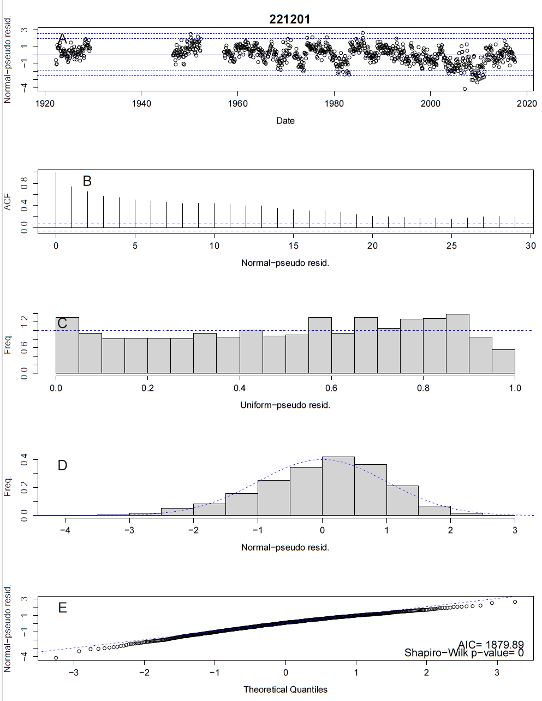

```{r, include = FALSE}
knitr::opts_chunk$set(
  collapse = TRUE,
  comment = "#>"
)
```

```{r setup}
library(hydroState)
```

## Sub-annual models
Seasonal and monthly models provide further insight into the state of the rainfall-runoff relationship throughout the year, but with this more sensitive analysis, there is often more seasonal variation and auto-correlation. hydroState provides additional options to explain this variation so models are statistically adequate. These options are located within the `buildModel` function. The seasonal variation can be explained with a sinusoidal function for a particular parameter through identifying `seasonal.parameters` in `buildModel`. This vignette provides an example of an analysis on a monthly time-step with the intercept, `a0`, as a `seasonal.parameters`.

## Load required data
Seasonal and monthly rainfall-runoff models require a data frame with catchment average runoff and precipitation for each month. Load the data into the environment. Ensure there are four columns named "year", "month", "flow", and "precipitation", and verify the units for flow and precipitation are the same ('mm', 'in', etc.). 

Note, hydroState parses the `input.data` given in sequential order by year, month, and day (1950-01-01, 1950-01-02 or 1978-11, 1978-12, 1980-01, etc). Avoid re-labeling months in water-years for seasonal and monthly `input.data'. Use calender years. 

```r
data(streamflow_monthly_221201)

# check input data
head(streamflow_monthly_221201)
#>   year month      flow precipitation
#> 1 1922     5  2.521175      47.81208
#> 2 1922     6  2.412904      56.06649
#> 3 1922     7 15.337419     186.79810
#> 4 1922     8 25.799507      73.82219
#> 5 1922     9 26.012962     107.27834
#> 6 1922     10 13.654558      59.42736

```

For a seasonal analysis, hydroState provides an additional `set.seasons` function to adjust the monthly data into seasons. The flow and precipitation are summed every three months and shown in the last month of the season.  The number of months in each season is included. An example of this is shown below.
```r
# aggregate monthly data to seasonal
streamflow_seasonal_221201 = set.seasons(streamflow_monthly_221201)

# check seasonal data
head(streamflow_seasonal_221201)
#>  year month     flow precipitation nmonths
#> 1 1922     8 43.54983     316.68678       3
#> 2 1922    11 48.00441     200.60889       3
#> 3 1923     2 20.97989     104.40220       3
#> 4 1923     5 16.52530      41.23328       3
#> 5 1923     8 27.94948     243.65699       3
#> 6 1923    11 51.88673     391.47728       3

```

## Build a sub-annual hydroState model
For seasonal and monthly models, there are additional options when building a model. A default model can be built that is identical to the default annual model except on a monthly or seasonal time-step OR the model can be adjusted.

In addition to the options presented in the previous vignette: ([adjust.state.model](https://github.com/peterson-tim-j/HydroState/tree/master/vignettes/adjust.state.model/adjust.state.model.html)), the seasonal and monthly models can assume parameters within the rainfall-runoff relationship vary seasonally throughout the year. This is available within the `seasonal.parameters`. This assumes a `parameter` is best modeled as a sinusoidal function representing seasonal trends. The input accepts any default parameter: `a1`, `a0`, or `std`. Typically, assuming seasonal trends in only the intercept, `a0`, explains trends in the residuals of the model. For further details, see help page for `buildModel`.

For this analysis, an adjusted model is built on a monthly time-step:

```r
# Build monthly hydroState model with adjusted model, seasonal forcing
model.monthly.adjusted = buildModel(input.data = streamflow_monthly_221201,
                          seasonal.parameters = list('a0'),
                          data.transform = 'log')
```

## Fit the model
Fit the built models with `fitModel`.

```r
model.monthly.adjusted = fitModel(model.monthly.adjusted, pop.size.perParameter = 10, max.generations = 1000, doParallel = TRUE)
```

## Review the residuals
Review the model's residuals from figures using `plot.residuals` to ensure they are uniform and normally distributed with no trends or auto-correlation.

```r
# review residual plots
plot.residuals(model.monthly.adjusted, do.pdf = F, ID ='221201')
```

<center>
{width=70%}
<\center>


## Evaluate the state-shifts
Set the state names relative to a year in the record using `setInitialYear`. This provides a name for the states so they are easier to interpret in the following figures. Then plot the state-shifts overtime using `plot.states`. In this example, 1990 is chosen as the year of reference. All four plots within the function are shown here, but either plot or combination of plots can be selected. Alternatively, the states can be reviewed without plotting using `get.states` which returns a data frame of states at each time-step.

```r
# set the reference year to name the states
model.monthly.adjusted= setInitialYear(model.monthly.adjusted, 1990)


# plot all four plots
plot.states(model.monthly.adjusted, do.pdf = F)

```

## Systematic model selection for sub-annual models
To identify the best sub-annual model, a systematic evaluation of the possible model combinations can be performed using the `buildModelAll` function. Below is an example evaluating all possible model combinations when `a0` and `std` are the state dependent parameters, and `a0` is expressed as a `seasonal.parameter`. The procedure is identical to the systematic model evaluation within the ([adjust.state.model](https://github.com/peterson-tim-j/HydroState/tree/master/vignettes/adjust.state.model/adjust.state.model.html)) vignette, expect `seasonal.parameters` may be selected. 

```r
# Build all possible models with the intercept, 'a0', as a seasonal parameter and state dependent parameter
all.models.monthly = buildModelAll(input.data = streamflow_monthly_221201,
                                        state.shift.parameter = list('a0','std'),
                                        seasonal.parameter = list('a0'))

# Review the order of the reference models, adjust reference models if needed.
all.models.ref.table = showModelAll(all.models.monthly)

# Re-build with adjusted reference table
all.models.monthly = buildModelAll(input.data = streamflow_monthly_221201,
                                        state.shift.parameter = list('a0','std'),
                                        seasonal.parameter = list('a0'),
                                        reference.table = all.models.ref.table)

# Fit all models (uncomment to run)
<!-- all.models.monthly = fitModel(all.models.monthly, pop.size.perParameter = 10, max.generations = 1000, doParallel = T) -->

# Identify the best model with the lowest AIC
get.AIC(all.models.monthly)
```

